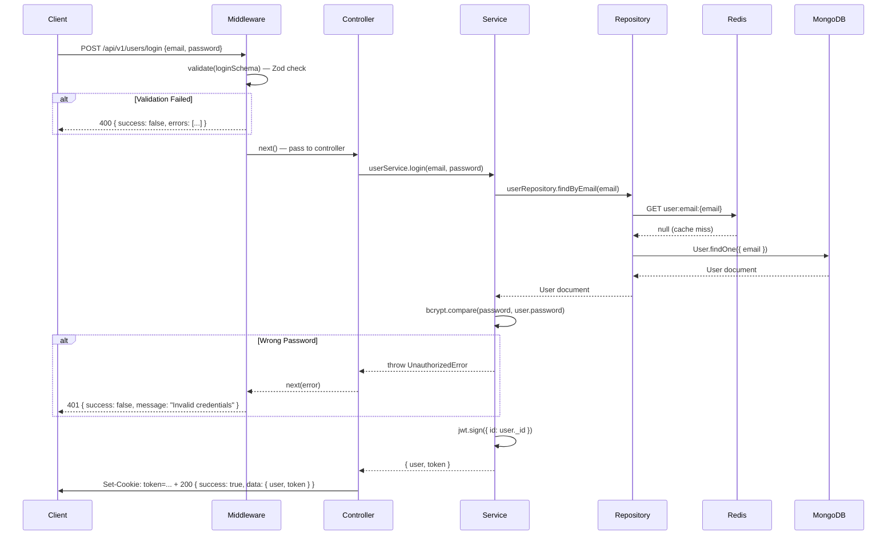

# 🏛️ LinkUp — Architecture Deep Dive

> _Understanding how the layers communicate is the key to contributing confidently._

---

## Table of Contents

1. [The Core Philosophy](#the-core-philosophy)
2. [The Three-Layer Architecture](#the-three-layer-architecture)
3. [Layer 1: The Controller](#layer-1-the-controller)
4. [Layer 2: The Service](#layer-2-the-service)
5. [Layer 3: The Repository](#layer-3-the-repository)
6. [The Middleware Pipeline](#the-middleware-pipeline)
7. [Full Request Lifecycle (Mermaid Diagram)](#full-request-lifecycle)
8. [Data Flow: Register a New User](#data-flow-register-a-new-user)
9. [The Cache-Aside Pattern](#the-cache-aside-pattern)
10. [Error Propagation Flow](#error-propagation-flow)
11. [Technical Debt & Gaps](#technical-debt--gaps)
12. [Next Steps](#next-steps)

---

## The Core Philosophy

Before v1.1.0, all logic for a user operation (database query, password hashing, token generation, validation) lived inside a single controller function. This is often called a **"Fat Controller"** and it creates serious problems at scale:

- You cannot test business logic without starting an HTTP server
- A database change forces you to re-read and re-understand HTTP logic
- A single function doing 5 different things is nearly impossible to debug

LinkUp now follows a **Separation of Concerns** principle, organized as three distinct layers. Each layer has a **single job** and communicates with the layer below it through a clean interface.

---

## The Three-Layer Architecture

```
┌──────────────────────────────────────────┐
│              HTTP Request                │
│         (e.g., POST /register)           │
└───────────────────┬──────────────────────┘
                    │
                    ▼
         ┌──────────────────┐
         │   MIDDLEWARE     │  ◄── Runs BEFORE the controller
         │ ┌──────────────┐ │      1. validate()  — Zod schema check
         │ │authenticate()│ │      2. authenticate() — JWT verification
         │ └──────────────┘ │
         └────────┬─────────┘
                  │
                  ▼
  ┌───────────────────────────────┐
  │         CONTROLLER            │  Layer 1
  │      user.controller.js       │
  │  • Reads from req.body/params │
  │  • Calls the Service          │
  │  • Sends the HTTP response    │
  └───────────────┬───────────────┘
                  │
                  ▼
  ┌───────────────────────────────┐
  │           SERVICE             │  Layer 2
  │       user.service.js         │
  │  • Orchestrates business rules│
  │  • Hashes passwords           │
  │  • Generates JWT tokens       │
  │  • Throws domain errors       │
  └───────────────┬───────────────┘
                  │
                  ▼
  ┌───────────────────────────────┐
  │         REPOSITORY            │  Layer 3
  │     user.repository.js        │
  │  • Runs MongoDB queries       │
  │  • Checks Redis cache first   │
  │  • Writes back to cache       │
  └───────────────┬───────────────┘
                  │
       ┌──────────┴──────────┐
       ▼                     ▼
  ┌─────────┐          ┌─────────┐
  │ MongoDB │          │  Redis  │
  └─────────┘          └─────────┘
```

---

## Layer 1: The Controller

**File:** `controllers/user.controller.js`

**Single Job:** Be the traffic manager between HTTP and business logic.

### What it does:
- Reads data from `req.body`, `req.params`, `req.query`, or `req.file`
- Passes that data to the appropriate **Service** method
- Receives the result and sends it as an HTTP response via `ApiResponse`

### What it does NOT do:
- ❌ Touch the database directly
- ❌ Hash passwords or generate tokens
- ❌ Write complex conditional logic

### Example: The `register` controller

```javascript
export const register = asyncHandler(async (req, res) => {
    // 1. Delegate to Service — no business logic here
    const user = await userService.register(req.body);

    // 2. Return a standardized response
    return ApiResponse.success(res, user, "User registered successfully", 201);
});
```

> **Why `asyncHandler`?** It's a wrapper that catches any promise rejection and passes it to the global error handler. Without it, an uncaught async error would crash the server. With it, controllers never need a `try/catch`.

---

## Layer 2: The Service

**File:** `services/user.service.js`

**Single Job:** Enforce business rules and orchestrate operations.

### What it does:
- Checks if a user already exists before creating one
- Hashes passwords using bcrypt before storing
- Generates JWT tokens with a defined expiry
- Strips sensitive data (like `password`) before returning user objects
- Throws **typed domain errors** (`ConflictError`, `NotFoundError`, etc.)

### What it does NOT do:
- ❌ Write raw MongoDB queries
- ❌ Return HTTP responses
- ❌ Know anything about `req` or `res`

### Example: The `register` service method

```javascript
async register(userData) {
    // Rule 1: No duplicate users
    const existingUser = await this.userRepository.checkExists(userData.email, userData.username);
    if (existingUser) throw new ConflictError("User with this email or username already exists");

    // Rule 2: Passwords must be hashed before storage — NEVER store plaintext
    const hashedPassword = await bcrypt.hash(userData.password, 10);

    // Rule 3: Create and return user, but NEVER expose the password field
    const user = await this.userRepository.create({ ...userData, password: hashedPassword });
    const { password, ...userWithoutPassword } = user.toObject();
    return userWithoutPassword;
}
```

> **Why throw domain errors instead of returning `null`?** When a service returns `null` for a missing user, the controller has to check for null and decide what HTTP status to return — that's business logic leaking into the controller. By throwing a `NotFoundError`, the global error handler decides the HTTP status automatically, keeping the controller clean.

---

## Layer 3: The Repository

**File:** `repositories/user.repository.js`

**Single Job:** Be the only place where database (and cache) queries live.

### What it does:
- Wraps Mongoose model calls (`User.findById`, `User.findOne`, etc.)
- Implements the **Cache-Aside Pattern** for `findById` and `findByUsername`
- Invalidates cached entries when data is updated

### What it does NOT do:
- ❌ Contain business rules
- ❌ Send HTTP responses
- ❌ Know what "hashing a password" means

### Example: `findById` with Cache-Aside

```javascript
async findById(id) {
    const cacheKey = `user:id:${id}`;       // 1. Build the cache key
    let user = await cache.get(cacheKey);   // 2. Try Redis first

    if (!user) {
        user = await User.findById(id);     // 3. Cache MISS → hit MongoDB
        if (user) await cache.set(cacheKey, user, 300); // 4. Populate cache (TTL: 5 min)
    }
    return user;                            // 5. Return — either from cache or DB
}
```

---

## The Middleware Pipeline

Middleware are functions that run **in order** before any controller is reached. Think of them as checkpoints on a highway.

```
Request arrives
      │
      ▼
[cors()]            — Allow cross-origin requests from the frontend
      │
      ▼
[express.json()]    — Parse the raw JSON body into req.body
      │
      ▼
[cookieParser()]    — Parse cookies (so req.cookies.token is accessible)
      │
      ▼
[route-specific middleware: validate(schema)]
      │              Validates req.body against Zod schema
      │              If invalid → throws ValidationError immediately
      ▼
[route-specific middleware: authenticate()]
      │              Reads JWT from cookie or Authorization header
      │              If missing/invalid → throws UnauthorizedError
      ▼
[Controller function]
      │
      ▼
[Global Error Handler: errorHandler()]
              Catches ANY error thrown above
              Returns standardized error JSON response
```

### Why is the error handler at the END?

Express identifies a global error handler by its **4-argument signature**: `(err, req, res, next)`. By registering it last in `server.js`, it catches errors from every route and every middleware above it. This is why every error thrown anywhere in the app ends up here — no individual controller needs a `try/catch`.

---

## Full Request Lifecycle



---

## Data Flow: Register a New User

Step-by-step walkthrough of `POST /api/v1/users/register`:

| Step | Layer | Action |
|------|-------|--------|
| 1 | Middleware | `validate(registerSchema)` parses and enforces the Zod schema |
| 2 | Controller | Extracts `req.body`, delegates to `userService.register()` |
| 3 | Service | Calls `userRepository.checkExists(email, username)` |
| 4 | Repository | Runs `User.findOne({ $or: [{ email }, { username }] })` |
| 5 | Service | If found → throws `ConflictError(409)` |
| 6 | Service | Runs `bcrypt.hash(password, 10)` — 10 salt rounds is the industry minimum |
| 7 | Repository | Calls `user.save()` to persist to MongoDB |
| 8 | Service | Destructs `{ password, ...rest }` — removes password from object |
| 9 | Controller | Calls `ApiResponse.success(res, user, "...", 201)` |

---

## The Cache-Aside Pattern

> **The Problem:** Finding a user by ID happens on every authenticated request (profile views, posts, etc.). Hitting MongoDB every time is expensive.
>
> **The Solution:** Store the result in Redis for 5 minutes after the first lookup. Subsequent requests are served from memory — magnitudes faster.

```
   ┌───────────────────────────────────────────┐
   │         findById(id)                      │
   └──────────────────┬────────────────────────┘
                      │
              ┌───────▼────────┐
              │ Check Redis    │
              │ GET user:id:{} │
              └───────┬────────┘
          ┌───────────┴──────────────┐
     [HIT]│                          │[MISS]
          ▼                          ▼
    Return cached            Query MongoDB
    user object              User.findById(id)
                                    │
                             Store in Redis
                             SET user:id:{} TTL=300
                                    │
                             Return user object
```

**Cache Invalidation:** When `update()` is called, the repository deletes **all three** keys:
- `user:id:{id}`
- `user:username:{username}`
- `user:email:{email}`

This ensures stale data is never served after an update.

---

## Error Propagation Flow

```
Any Layer throws: throw new NotFoundError("User not found")
                          │
                          │ (propagates via next(error) through asyncHandler)
                          ▼
              ┌───────────────────────┐
              │    errorHandler()     │  middleware/error-handler.middleware.js
              │                       │
              │  err instanceof       │
              │  AppError?            │
              │  ┌────────┐ ┌───────┐ │
              │  │  YES   │ │  NO   │ │
              │  └───┬────┘ └───┬───┘ │
              └──────┼──────────┼─────┘
                     │          │
                     ▼          ▼
             Return known   Log full stack trace
             status + MSG   Return 500 (sanitized in prod)
             e.g., 404 +
             "User not found"
```

**Custom Error Hierarchy:**

```
Error (native JS)
└── AppError (base class, adds statusCode + isOperational)
    ├── ValidationError  (400) — Zod failures with field-level details
    ├── NotFoundError    (404) — Resource doesn't exist
    ├── UnauthorizedError (401) — No token or invalid token
    ├── ForbiddenError   (403) — Valid token, insufficient permissions
    └── ConflictError    (409) — Duplicate email/username
```

---

## Technical Debt & Gaps

| Issue | Severity | Description |
|-------|----------|-------------|
| No `logout` endpoint | Medium | The cookie is set on login but never cleared server-side. Clients must delete it manually. |
| `findByEmail` not cached | Low | Used only during login (less frequent), but adding a cache layer here would complete consistency. |
| No email index composite | Low | Index is on `email: 1` and `username: 1` separately. A compound index is not needed here (correct design), but worth a note. |
| `posts.routes.js` is a stub | High | The file exists with no routes defined. The Posts module is not functional end-to-end. |
| No refresh token mechanism | High | JWTs expire in 1 hour with no renewal path. Users are forced to re-login. |
| No rate limiting | Medium | Register and login endpoints have no `express-rate-limit` protection. A brute-force attack is possible. |
| Missing `CORS` configuration | Medium | `app.use(cors())` is called with no options, allowing all origins. In production this must be locked to specific domains. |
| No input sanitization | Medium | While Zod validates shape, there is no HTML/NoSQL injection sanitization (e.g., `mongo-sanitize`). |
| Profile model not connected to user layer | High | `profile.model.js` exists but has no corresponding service, repository, or controller. |

---

## Next Steps

- 📖 Read [api.md](./api.md) — documented endpoint contracts
- 🗄️ Read [database.md](./database.md) — Mongoose models and relationships
- 🛠️ Read [development.md](./development.md) — contributing patterns and conventions
